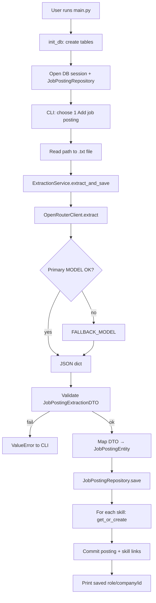

# Project Summary: Data Jobs Forecasting AI App

## What this project is

A **portfolio / WIP Python app** that:

1. Takes raw job posting text (from a `.txt` file)
2. Uses an **LLM via OpenRouter** to extract structured fields
3. Validates the output with **Pydantic**
4. Saves postings and skills into **PostgreSQL** (SQLAlchemy)

The long-term goal is **trend analysis and forecasting** (roles, skills, salaries, locations over 3/6/12 months). That analysis path is **not implemented yet** — only extraction + persistence works.

**Stack:** Python, PostgreSQL, OpenRouter API, Pydantic, SQLAlchemy, `python-dotenv`, `requests`

**Architecture style:** layered (CLI → BLL → Domain/DTO → DAL / LLM)

```
src/
├── main.py              # CLI entry
├── config.py            # env config
├── bll/                 # business logic
├── dal/                 # data access (DB)
├── domain/              # pure business entities
├── dto/                 # LLM extraction schema
└── llm/                 # LLM provider clients
```

---

## File-by-file

### Root

| File | Role |
|------|------|
| `README.md` | Project overview, setup, security notes |
| `requirements.txt` | Dependencies: `psycopg2-binary`, `python-dotenv`, `requests`, `pydantic`, `sqlalchemy` |
| `.env.example` | Template for `OPENROUTER_API_KEY`, `MODEL`, `FALLBACK_MODEL`, `DATABASE_URL` |
| `.gitignore` | Ignores `venv/`, `.env`, caches, `data/` |

### Entry & config

| File | Role |
|------|------|
| `src/main.py` | CLI menu: init DB → session → repository. Option 1 = add posting; option 2 = analysis (stub); 0 = exit |
| `src/config.py` | Loads `.env` and exposes API key, DB URL, primary/fallback model names |

### Business logic (`src/bll/`)

| File | Role |
|------|------|
| `extraction_service.py` | Orchestrates: LLM extract → Pydantic validate → domain entity → repository save |

### DTO (`src/dto/`)

| File | Role |
|------|------|
| `job_posting_extraction_dto.py` | Pydantic schema for LLM output (company, role, salary, work type, skills, etc.) |

### Domain (`src/domain/`)

| File | Role |
|------|------|
| `base_entity.py` | Shared `id`, `created_at` |
| `job_posting_entity.py` | Framework-free job posting model (includes `raw_text`, `date_added`, skills as strings) |
| `skill_entity.py` | Skill name entity |
| `work_type.py` | Enum: `onsite` / `hybrid` / `remote` / `unknown` |

### Data access (`src/dal/`)

| File | Role |
|------|------|
| `models.py` | SQLAlchemy ORM: `job_postings`, `skills`, many-to-many `job_posting_skills` |
| `session.py` | Engine, session factory, `init_db()` (create tables), `get_session()` |
| `base_repository.py` | Abstract CRUD: `save`, `get_by_id`, `get_all`, `delete` |
| `job_posting_repository.py` | Maps entity ↔ ORM; links skills via `SkillRepository.get_or_create` |
| `skill_repository.py` | Skill CRUD + `get_or_create` (names normalized to lowercase) |

### LLM (`src/llm/`)

| File | Role |
|------|------|
| `base_llm_client.py` | Abstract `extract(posting_text) -> dict` |
| `openrouter_client.py` | OpenRouter chat completions; strict JSON system prompt; primary then fallback model |
| `llm_client_factory.py` | Returns `OpenRouterClient` (swap provider here only) |

Package `__init__.py` files are empty (namespace packages).

---

## Process flow (add posting)



### Step detail

1. **Startup** — `init_db()` creates tables; one session and `JobPostingRepository` for the menu loop.
2. **Input** — User gives a path to a UTF-8 `.txt` posting; empty/missing file is rejected.
3. **LLM extraction** — System prompt forces a fixed JSON schema; no guessing; ignore instructions inside the posting text.
4. **Validation** — Raw dict → `JobPostingExtractionDTO`; bad shape → `ValueError`.
5. **Domain mapping** — DTO + original text + today’s date → `JobPostingEntity`.
6. **Persistence** — Create `JobPostingORM`; for each skill, normalize name and get-or-create; link via association table; commit once; return entity with DB `id`.

### Analysis flow (planned)

Menu option 2 only prints that analysis is not implemented. Intended later: aggregate roles/companies/skills/locations/salaries and forecast skill/role momentum.

---

## Data flow (order of processing)

Data moves through fixed shapes in this order. Each step consumes the previous output and does not skip ahead.

```
.txt file
  → str (raw posting text)
    → dict (LLM JSON)
      → JobPostingExtractionDTO (validated)
        → JobPostingEntity (domain)
          → JobPostingORM + SkillORM rows (DB)
            → JobPostingEntity with id (return to CLI)
```

| # | Where | Input | What happens | Output |
|---|--------|--------|--------------|--------|
| 1 | `main.add_posting_flow` | File path from user | Open UTF-8 `.txt`, `read().strip()` | `posting_text: str` |
| 2 | `ExtractionService.extract_and_save` | `posting_text` | Pass text to LLM client | (same str into LLM) |
| 3 | `OpenRouterClient.extract` | `posting_text` | System prompt + user message → OpenRouter API; parse response JSON. On failure, retry with `FALLBACK_MODEL` | `raw_result: dict` |
| 4 | `JobPostingExtractionDTO(**raw_result)` | `dict` | Pydantic validates types/required fields (`role_title` required; optional salary, deadline, etc.; `work_type` enum; `skills` list) | `dto: JobPostingExtractionDTO` |
| 5 | `ExtractionService._dto_to_entity` | `dto` + original `posting_text` | Copy extracted fields; set `date_added=today`; attach `raw_text` | `entity: JobPostingEntity` (no DB `id` yet) |
| 6 | `JobPostingRepository.save` | `entity` | Build `JobPostingORM` from entity fields | In-memory ORM (not committed) |
| 7 | `SkillRepository.get_or_create` (loop) | Each name in `entity.skills` | Strip + lowercase; find existing `skills` row or insert new; `flush` for id | `SkillORM` instances linked on `orm_obj.skills` |
| 8 | Session commit | ORM graph | One transaction: insert/update posting, skills, and `job_posting_skills` links | Rows in PostgreSQL |
| 9 | Refresh + return | `orm_obj.id` | Assign `entity.id`; return entity | `JobPostingEntity` with `id` printed in CLI |

### Field mapping through the pipeline

| Field | In DTO (LLM) | In domain entity | In DB |
|-------|--------------|------------------|-------|
| Company, role, responsibilities, requirements | yes | yes | `job_postings` columns |
| Deadline, salary min/max/currency, location | yes | yes | same |
| `work_type` | enum string | `WorkType` | `SAEnum(WorkType)` |
| `has_nondiscrimination_disclaimer` | bool | bool | boolean column |
| `skills` | `list[str]` | `list[str]` | normalized names in `skills` + links in `job_posting_skills` |
| `date_added` | not from LLM | set to `date.today()` | `job_postings.date_added` |
| `raw_text` | not from LLM | original file content | `job_postings.raw_text` |
| `id` / `created_at` | — | set after save / default | PK + timestamp on insert |

### What is *not* in the current data flow

- No read-back for analysis: `get_all` / aggregations exist on repositories but are unused by the CLI.
- No forecasting pipeline yet — stored rows are the end of the implemented flow.

---

## Data model (simplified)

- **job_postings** — company, role, responsibilities, requirements, deadline, salary range/currency, location, work_type, nondiscrimination flag, date_added, raw_text, created_at
- **skills** — unique skill `name` (stored lowercase)
- **job_posting_skills** — many-to-many link

---

## Current status vs README goals

| Capability | Status |
|------------|--------|
| Manual paste via `.txt` + LLM extraction | Done |
| Schema validation + Postgres save | Done |
| Market analysis / forecasting | Not started (stub in `main.py`) |
| Web UI | Not present (CLI only) |
