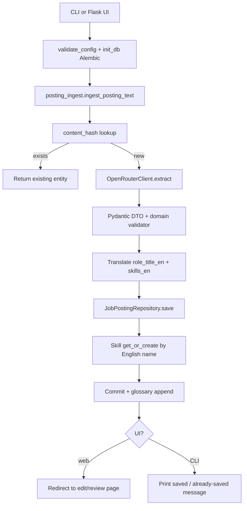

# Project Summary: Data Jobs Forecasting AI App

## What this project is

A **portfolio / WIP Python app** that:

1. Accepts raw job posting text (CLI `.txt` path, or web paste / `.txt` upload)
2. Uses an **LLM via OpenRouter** to extract structured fields
3. Validates with **Pydantic** plus domain rules
4. Translates role titles and skills to English (glossary first, then LLM)
5. Saves postings and skills into **PostgreSQL** (SQLAlchemy + Alembic)
6. Offers a **Flask UI** to review and edit key saved fields

The long-term goal is **trend analysis and forecasting** (roles, skills, salaries, locations over 3/6/12 months). That analysis path is **not implemented yet** (CLI menu stub only).

**Stack:** Python, PostgreSQL, SQLAlchemy, Alembic, Flask + Jinja2, OpenRouter API, Pydantic, `python-dotenv`, `requests`, pytest

**Architecture:** layered CLI/Web → BLL → Domain/DTO → DAL / LLM

```
src/
├── main.py                 # CLI entry (python -m src.main)
├── config.py               # env + validate_config()
├── bll/                    # business logic / orchestration
├── dal/                    # SQLAlchemy models, session, repositories
├── domain/                 # pure entities + hash helper
├── dto/                    # LLM extraction schema
├── llm/                    # OpenRouter extract/translate + error messages
└── web/                    # Flask UI (python -m src.web)
alembic/                    # migrations
glossary/original_en.tsv    # original → English label glossary
tests/                      # pytest suite
```

---

## File-by-file

### Root

| File / folder | Role |
|---------------|------|
| `README.md` | Setup, CLI/web run instructions, migrations, security |
| `requirements.txt` | `psycopg2-binary`, `python-dotenv`, `requests`, `pydantic`, `sqlalchemy`, `alembic`, `pytest`, `flask` |
| `.env.example` | `OPENROUTER_API_KEY`, `MODEL`, `FALLBACK_MODEL`, `DATABASE_URL`, `SECRET_KEY` |
| `.gitignore` | `venv/`, `.env`, caches, `data/`, pytest artifacts |
| `PROJECT_SUMMARY.md` | This document |
| `pytest.ini` | `pythonpath = .`, `testpaths = tests` |
| `alembic.ini` | Alembic config (URL injected from `.env`) |
| `glossary/original_en.tsv` | Tab-separated original → English pairs |
| `.cursor/` | Agent rules and implementation plans |

### Entry & config

| File | Role |
|------|------|
| `src/main.py` | CLI menu; uses `ingest_posting_text`; analysis stub |
| `src/config.py` | Loads `.env`; `validate_config()` fails fast if required vars missing |
| `src/web/__main__.py` | Runs Flask app (`python -m src.web`) |
| `src/web/__init__.py` | `create_app()` — templates/static, `SECRET_KEY`, optional startup migrate |

### Business logic (`src/bll/`)

| File | Role |
|------|------|
| `posting_ingest.py` | Shared CLI/web entry: session → `ExtractionService.extract_and_save` |
| `extraction_service.py` | Dedup by hash → LLM extract → validate → translate EN → save → glossary |
| `job_posting_validator.py` | Domain rules (non-empty title, salary range, drop blank skills) |
| `glossary.py` | Load/lookup/append `glossary/original_en.tsv` |

### DTO (`src/dto/`)

| File | Role |
|------|------|
| `job_posting_extraction_dto.py` | Pydantic schema for LLM JSON (incl. country/city, skills, etc.) |

### Domain (`src/domain/`)

| File | Role |
|------|------|
| `base_entity.py` | Shared `id`, `created_at` |
| `job_posting_entity.py` | Posting model (`role_title_en`, `skills` / `skills_en`, `content_hash`, …) |
| `skill_entity.py` | `name`, `display_name`, `display_name_en` |
| `work_type.py` | `onsite` / `hybrid` / `remote` / `unknown` |
| `posting_hash.py` | SHA-256 of stripped raw text for dedup |

### Data access (`src/dal/`)

| File | Role |
|------|------|
| `models.py` | ORM: `job_postings`, `skills`, `job_posting_skills` |
| `session.py` | Lazy engine, `session_scope()`, `init_db()` → Alembic upgrade head |
| `base_repository.py` | Abstract CRUD |
| `job_posting_repository.py` | Save/get/delete; `update_review_fields` for UI edits |
| `skill_repository.py` | `get_or_create` by lowercase English `name`; savepoint on unique race |

### LLM (`src/llm/`)

| File | Role |
|------|------|
| `base_llm_client.py` | Abstract `extract(posting_text) -> dict` |
| `openrouter_client.py` | Extraction chat completions; primary then fallback model |
| `translation.py` | Glossary-first English translation via OpenRouter |
| `error_messages.py` | User-facing messages for 429 / API key / timeout / connection |
| `llm_client_factory.py` | Returns `OpenRouterClient` |

### Web (`src/web/`)

| File | Role |
|------|------|
| `routes/postings.py` | `GET/POST /` ingest; `GET/POST /postings/<id>/edit` review/update |
| `templates/base.html` | Layout, flash area, CSS link |
| `templates/postings/new.html` | Paste + file upload form |
| `templates/postings/edit.html` | Editable extracted fields + English skills |
| `static/css/main.css` | Navy / dark red / dark gray / light gray design tokens |

### Migrations & tests

| Path | Role |
|------|------|
| `alembic/versions/20260726_0001_…` | Baseline schema |
| `alembic/versions/20260726_0002_…` | `country`, `city` |
| `alembic/versions/20260726_0003_…` | `role_title_en`, `display_name_en` |
| `tests/` | Config, validator, hash/dedup, skills, glossary, translation, LLM errors, Flask routes |

---

## Process flow (add posting)



### Step detail

1. **Startup** — validate env; Alembic migrates to `head`.
2. **Input** — CLI: file path. Web: paste and/or `.txt` upload (file wins if present).
3. **Dedup** — SHA-256 of stripped text; if known, skip LLM and return existing row.
4. **LLM extraction** — fixed JSON schema; primary model then fallback.
5. **Validation** — Pydantic schema, then domain rules.
6. **Translation** — glossary lookup, else LLM; on failure keep original text.
7. **Persistence** — posting + skills (unique on lowercase English name) + M2M links.
8. **Glossary** — append new original→English pairs for title and skills.
9. **Web only** — open review page; user can edit fields and save again (DB + glossary).

### Analysis flow (planned)

CLI option 2 / future UI: not implemented. Intended later: aggregates and forecasts.

---

## Data flow (order of processing)

```
raw posting text (str)
  → content_hash (optional short-circuit)
    → dict (LLM JSON)
      → JobPostingExtractionDTO
        → domain validation
          → JobPostingEntity (+ role_title_en, skills_en)
            → JobPostingORM + SkillORM (+ glossary TSV)
              → entity with id (CLI print or web edit form)
```

| # | Where | What happens |
|---|--------|----------------|
| 1 | CLI / web route | Obtain UTF-8 posting text |
| 2 | `ingest_posting_text` | Open `session_scope`, call extraction service |
| 3 | `ExtractionService` | Hash lookup; skip LLM if duplicate |
| 4 | `OpenRouterClient.extract` | Primary then fallback model |
| 5 | DTO + `validate_extraction_dto` | Schema + business rules |
| 6 | Translator + glossary | English role title and skills |
| 7 | Repository `save` | Insert posting; `get_or_create` skills; commit |
| 8 | `add_entries` | Update `glossary/original_en.tsv` |
| 9 | Web edit (optional) | `update_review_fields` + glossary again |

### Field mapping (high level)

| Field | Source | Notes |
|-------|--------|--------|
| company, role, responsibilities, requirements | LLM | `role_title` required |
| `role_title_en` | glossary / translate | Same as title if already English |
| salary, deadline, location, country, city | LLM | optional |
| `work_type`, nondiscrimination flag | LLM | enum / bool |
| `skills` / `skills_en` | LLM + translate | DB skill `name` = lowercase English |
| `display_name` / `display_name_en` | first-seen original + English | on `skills` |
| `content_hash`, `raw_text`, `date_added` | app | not from LLM inventively |

---

## Data model (simplified)

- **job_postings** — company, role_title, role_title_en, responsibilities, requirements, deadline, salary min/max/currency, location, country, city, work_type, nondiscrimination flag, date_added, raw_text, content_hash (unique), created_at
- **skills** — unique `name` (lowercase English), `display_name`, `display_name_en`
- **job_posting_skills** — many-to-many link

---

## How to run (quick)

```bash
# CLI
python -m src.main

# Web UI
python -m src.web

# Migrations (also on app startup)
alembic upgrade head

# Tests
pytest
```

---

## Current status vs goals

| Capability | Status |
|------------|--------|
| Manual `.txt` / paste + LLM extraction | Done |
| Schema + domain validation + Postgres save | Done |
| Dedup by content hash | Done |
| English titles/skills + glossary | Done |
| Flask insert + review/edit UI | Done |
| Clearer AI error messages (429, key, network) | Done |
| Alembic migrations + pytest | Done |
| Market analysis / forecasting | Not started (CLI stub) |
